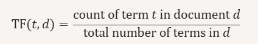
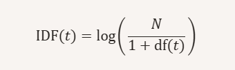
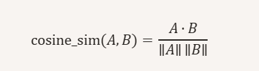
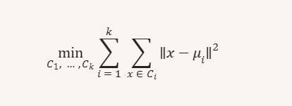
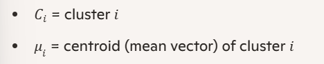
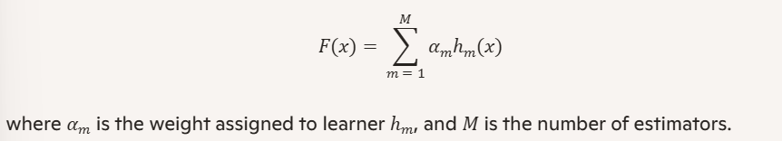
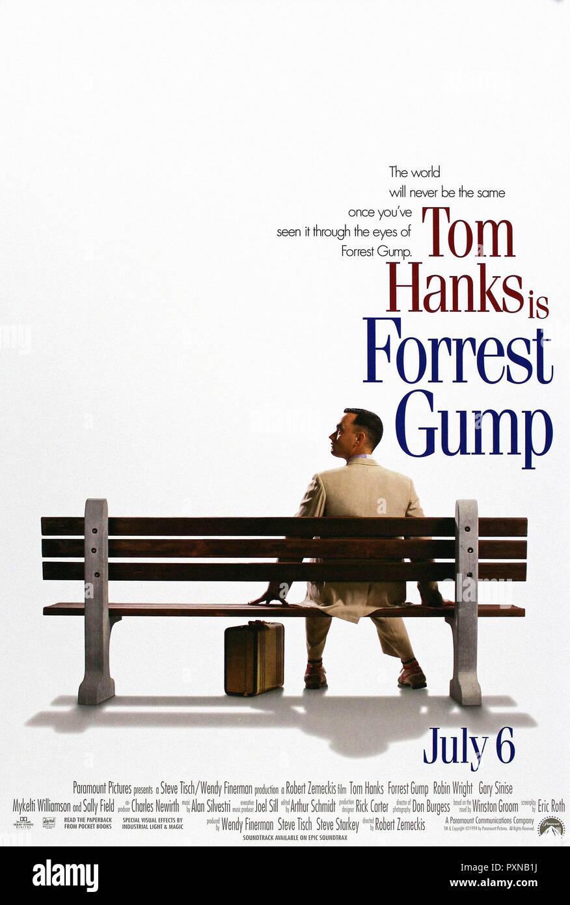
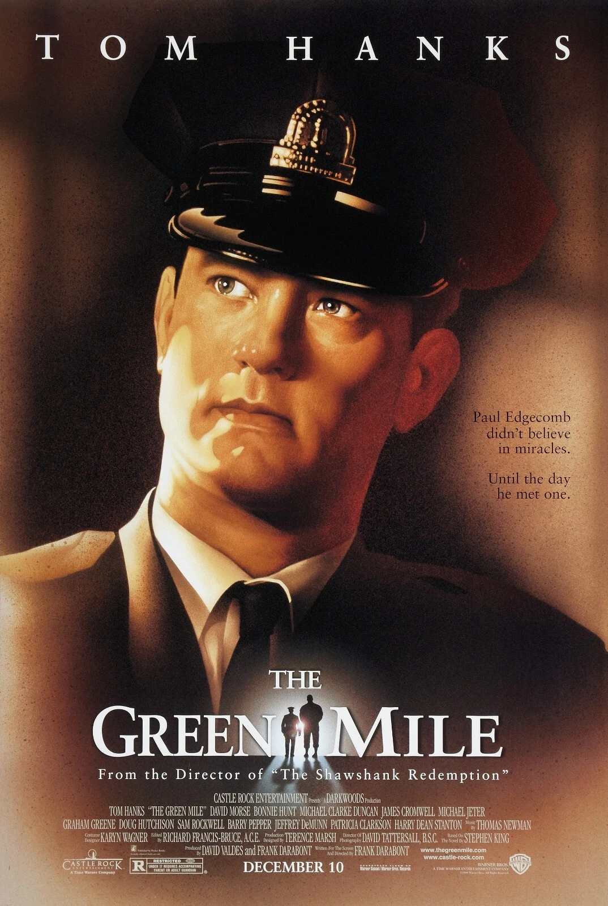
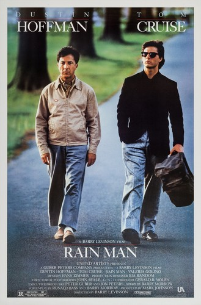

## INTRODUCTION
The purpose of this project was to create a movie recommendation system that takes one movie as input and gives 5 recommended movies. 
A content based recommender approach was chosen using several different methods and using a regression model that will be seperately explained later on.

Three original data sets (see README.md) were cleaned and processed (in preprocessing.py). The final working data set used in the recommendation system contains rows with movie-ID as index, and the columns are: title, (average) rating and tags. The tag-column for each movie contain one long string with all the words that users have used to describe that particular movie, (seperated by a space). The title-column includes title name as well as release year within parantheses. This was chosen in order to distinguish between movies with the same name. Average rating was chosen as a overall single value quality estimate per movie. This choice was deemed appropriate for this content-based system which doesn't rely on user-specific information.

## EXPLORATORY DATA ANALYSIS
To explore whether tags relate to movie ratings, the dataset was split into high-rated (rating > 4.0) and low-rated (rating < 3.0) films. A simple frequency analysis showed that high rated movies contained more quality- and mood-related words such as "great", "good", "classic", "Oscar", "atmospheric" and "thought-provoking", while low-rated movies used more generic or negatively associated terms. Genres were common for both, "comedy" appeared in both groups, "fantasy" and "sci-fi" in the high-rated films and "horror", "crime" and "romance" were common tags in the low-rated movies.

This difference suggested that tags carry meaningful information about perceived movie quality. The regression model later confirmed this: the most important features were the same value-laden and genre-related words identified in the frequency analysis. 

## Theory 

#### TF-IDF
The tags contain words. This is difficult to work with and therefore we need to vectorize the data in the tags to ensure that everything is numeric and can be combined with standard machine learning algortihm. To do this, the project utilized TF-IDF vectorization.

TF-IDF is a weighting scheme used to represent text numerically. It increases the weight of words that are important in a specific document while down-weighting words that are common across the entire corpus. 

where N is the number of documents and df(t) is the number of documents containing the term t. 

TF-IDF weight: TF-IDF(t,d) = TF(t,d) * IDF(t)

TF-IDF transforms text into a high-dimensional vector space where each dimension corresponds to a word or n-gram. So for in this recommendation system, each movie's entire tag string becomes one TF-IDF vector.Each vector represnts how important each word is for that movie compared to all other movies. 

#### COSINE SIMILARITY
Cosine similarity measures how similar two documents are by comparing the angle between their TF-IDF vectors. It works well for sparse TF-IDF vectors because it focuses on relative word usage. 

 

Value ranges from 0 to 1. 1 means identical direction (high similarity). 0 means orthogonal (no similarity).

In the context of this project, cosine similarity compares the movies's tag vectors. If two movies use the same important use words, their vectors point in similar directions.
TF-IDF already highlights meaningful words. Cosine similarity then checks wheter two movies highligt the same meaningful words.

### K-Means Clustering
This is an unsupervised learning algorithm that partitions data into k clusters by minimizing the distance between points and their assigned cluster centers. When applied to the TF-IDF vectors in our system, k-means groups the movies based on similarity in word usage. 

where:

Algorithm steps:
1. Initialize 𝑘 centroids
2. Assign each point to the nearest centroid
3. Update centroids as the mean of assigned points
4. Repeat until convergence

This is useful in the project to be able to pick movies from different clusters, ensuring that the final recommmendations are not too similar.

## MODEL
In addition to methods to ensure similarity as well as some diversity in the recommendations, we also require a method to determine quality of movies. A regression model was chosen to predict the mean rating from TF-IDF-vectorized tags. Several regression models were tested. GradientBoostingRegressor and ExtraTreesRegressor were both evaluated with randomized hyperparameter search (varying number of estimators, tree depth, learning rate and subsampling rate).

AdaBoostRegressor was also tested and ultimately chosen as the value regressor on mean rating. It was much faster and therefore more practical than the other models. This is an ensemble method that combines many weak learners (decision trees of depth 1, so-called decision stumps) into a strong predictor by iteratively reweighting training examples. On each iteration m, a weak learner is trained, and the final prediction is a weighted sum of these learners: 

Hyperparameters for AdaBoostRegressor (such as n_estimators and learning_rate) were tuned using RandomizedSearchCV with a 3-fold cross-validation on a subset of the training data. The best model was then retrained on the full training set and evaluated on a held-out test set using RMSE as the main metric.

## How the model is used in the recommendation system:
When a user inputs a movie, its tag text is transformed using the same TF-IDF vectorizer as during training. Cosine similarity is then computed between this vector and all other movie vectors to identify the most thematically similar movies. For each of these similar movies, the AdaBoost Model predicts an expected mean rating based on solely their tags. The recommendations are then ranked by a combination of similarity and predicted rating, ensuring that the system suggests movies that are both close in content and likely to be highly rated. These two signals - cosine similarity and predicted rating - are combined into a hybrid score. The top 50 movies according to this score are selected as candidates. To promote diversity, k-means clustering is then applied to the high-scoring candidates' TF-IDF vectors. 5 clusters are created, and one top-scoring movie from each is chosen for recommendation. 

## RESULTS
The model is value-regressor for the mean rating (ranging 0-5). RMSE measures how well the model predicts the rating. Using cross validation rmse on the training data, the model scored around 0.78. This means that on average the model missed by 0.78 rating units. 
The cv-standard deviation was around 0.02, meaning that the model is robust. Performing rmse on the test-data the result yielded almost identical results, meaning the model performs as expected compared to the CV-RMSE. This indicates no overfitting.

Even though there is a correlation between tags and rating, movie tags cannot completely explain/predict the variation in average rating for the movies. This was why the RMSE was somewhat high. We need to keep in mind that this model is used in combination with other methods in the full recommendation system. 
The final and most important result is how well the whole system actually recommends movies based on the input movie - and it did quite well. 

For example, the input movie Forrest Gump:  

The system gave these movies as output:

  
  
  
  
  

 ed to the following out put movies: Green Mile, The (1999), Captain Phillips (2013), Saving Private Ryan (1998), Rain Man (1988), Last Days in Vietnam (2014)

## DISCUSSION
The model captures some relationship between tags and ratings, but its helpfulness in this context is limited as previously discussed. 

Still, the hybrid approach—combining cosine similarity, predicted rating, and k‑means clustering—produces coherent and diverse recommendations in practice.

A key limitation is that the system is purely content‑based. Collaborative filtering could have captured user‑to‑user taste patterns that tags cannot represent, and would likely improve recommendation quality.

